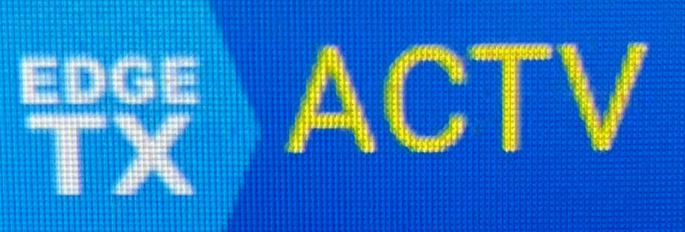

# thrhold
## Throttle hold/cut indicator widget for EdgeTX on large color screen radios (TX16S, etc)
This Lua script widget displays the throttle cut status in one of the title bar widget areas.
The code does not adjust font size and position for other larger widget areas on the main screen.
When the throttle is active, the string "ACTV" is displayed;
When the throttle cut is enabled, the string "TCUT" is displayed.

There are three options:
- Color - Selects the foreground color of the display text
- Source - Selects the two-value source (ideally) that controls the throttle cut
- Invert - Use to invert the ACTV/TCUT logic in the case where TCUT is displayed when it should be ACTV

## Installation
Simply copy the ThrHold directory in this
repo into the WIDGETS directory on your radio's SD card. You should then see a "ThrHold" entry in the
widget selector when configuring your title bar zones.
